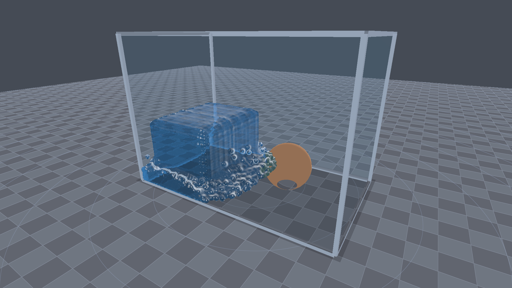
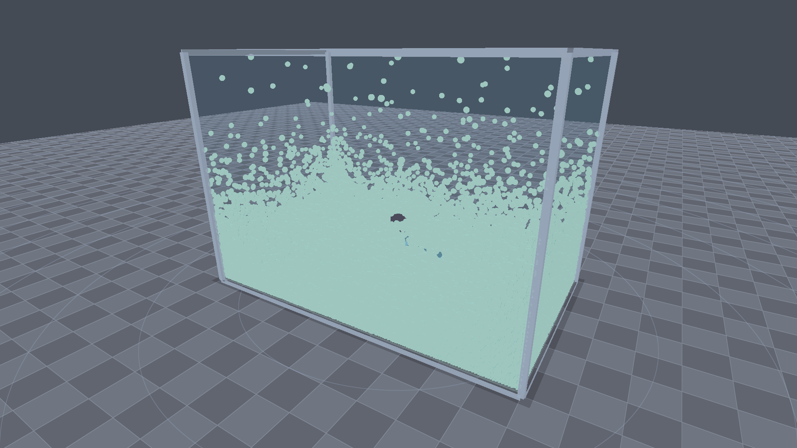
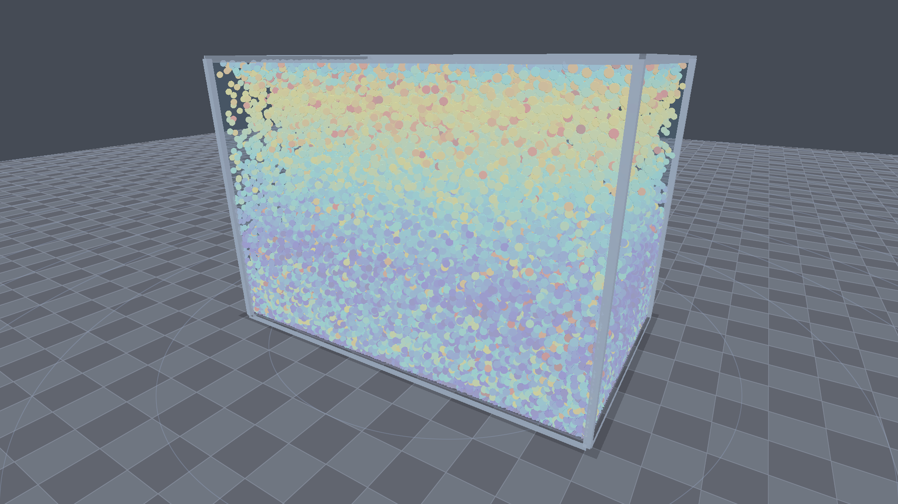
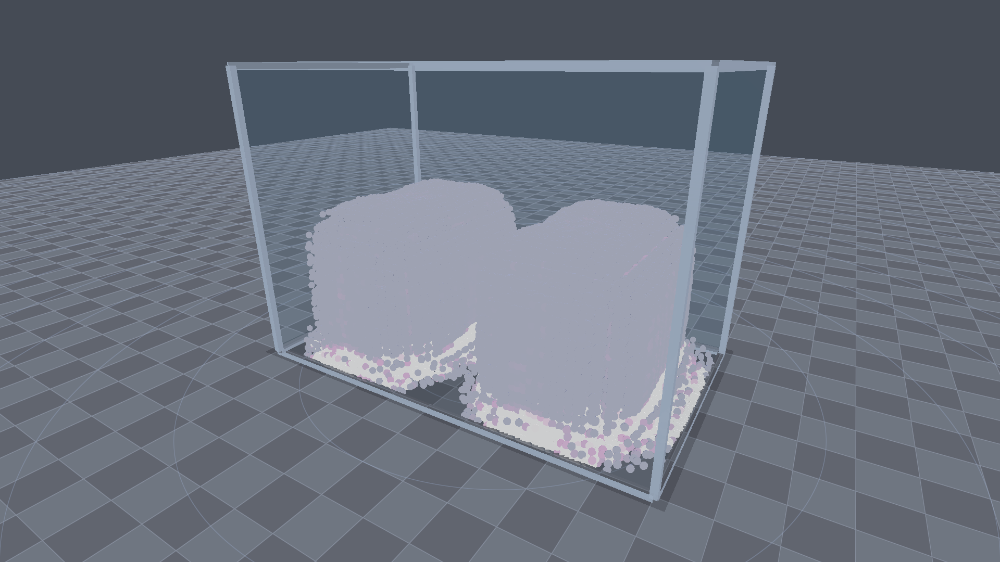
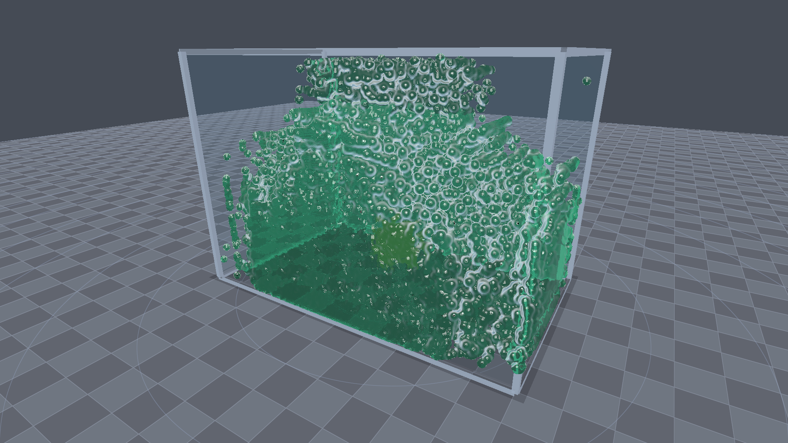

# Aether Fluid 3D — Real-Time 3D SPH Physics Simulation & Benchmark Engine

A real-time 3D fluid dynamics simulation and hardware benchmarking suite written in **Rust**, **WGSL compute shaders**, and **wgpu**.



---

## Highlights & Features

- **Dual Simulation Engines**:
  - **GPU Compute SPH**: Massive parallelization in WGSL with atomic 3D spatial hash grid (`atomicExchange`, `atomicLoad`, 27-neighborhood cell traversal). Easily handles **100,000+ particles** at 240+ FPS.
  - **CPU Parallel SPH**: Multi-threaded CPU solver powered by **Rayon** utilizing all CPU cores with spatial cell partitioning.
- **Physical SPH Solvers**:
  - Monaghan-Tait Equation of State for near-incompressible fluid dynamics
  - Spiky gradient pressure force kernel (eliminating tensile instability)
  - Viscosity Laplacian shear dissipation
  - Surface tension cohesion
  - Rest density & stiffness stabilization
  - Dynamic boundary collisions and velocity damping
- **Real-Time Rendering Pipeline**:
  - **Realistic Screen-Space Liquid**: Extract particle depth $\to$ Two-pass bilateral curvature-preserving filter $\to$ Screen-space normal reconstruction $\to$ Fresnel reflection $\to$ Screen-space refraction $\to$ Beer-Lambert exponential volumetric absorption $\to$ Blinn-Phong specular highlights.
  - **Raytraced 3D Shaded Spheres**: Per-particle raytraced billboards with specular glint, rim lighting, and shadow occlusion.
  - **Scientific Velocity Heatmap**: Real-time kinetic velocity coloring (blue $\to$ cyan $\to$ green $\to$ yellow $\to$ red).
  - **Hydrostatic Pressure Field**: Real-time compression and density field visualization.
- **Interactive Sandbox & Obstacles**:
  - Interactive obstacles: 3D spheres, spinning turbine rotors with blade sweep impulses, and bounding boxes.
  - Mouse interaction: Push and pull particles with radial attractor/repulsor forces.
  - Continuous water jet spray (inject fluid stream on demand with `Spacebar`).
  - Real-time obstacle dragging.
- **Automated Hardware Benchmark Suite**:
  - Automated multi-tier particle sweeps (10k, 25k, 50k, 100k+ particles).
  - Telemetry: Average FPS, 1% low FPS, P50/P95/P99 frametimes, Particle Updates Per Second (PUP/s), and estimated GFLOPS.
  - Grading system ($S+$, $S$, $A$, $B$, $C$, $D$) and automated export to `benchmark_results.json` and `benchmark_results.csv`.
  - Headless CLI execution mode without requiring a window or display server.

---

## Visual Gallery

| Realistic Liquid Dam Break | 3D Shaded Spheres Vortex Mixer |
|:---:|:---:|
|  |  |

| Scientific Velocity Heatmap | Hydrostatic Pressure Field |
|:---:|:---:|
|  |  |

| Viscous Emerald Honey | Interactive UI Dashboard |
|:---:|:---:|
|  | High-Tech Glass HUD with Real-Time Telemetry |

---

## Controls & Keybindings

| Input | Action |
|:---|:---|
| **Left Click + Drag** | Orbit camera around target |
| **Right Click + Drag** | Pan camera |
| **Scroll Wheel** | Zoom camera in / out |
| **Middle Click / Shift + Left Click** | Apply mouse force (Repel or Attract fluid) |
| **Spacebar (Hold)** | Continuous water jet nozzle spray into tank |
| **Left Click on Obstacle** | Drag and reposition obstacle in 3D space |
| **R** | Reset current scenario |
| **P** | Pause / Resume physics simulation |
| **H** | Toggle UI HUD overlay |

---

## Scenarios & Presets

1. **Dam Break**: Classic fluid dynamics benchmark with a column of water collapsing against the container walls and obstacles.
2. **Double Wave Collision**: Dual opposing fluid columns that surge towards the center and produce high-energy vertical splash sheets.
3. **Droplet Splash**: High-velocity droplet cascade impacting a calm water pool, forming crowns and Worthington jets.
4. **Viscous Honey**: High-viscosity, high-surface-tension fluid with laminar flow, dripping and coiling.
5. **Vortex Mixer**: Fluid agitated by a high-RPM 4-blade spinning turbine obstacle.
6. **Zero-G Surface Tension**: Zero-gravity fluid droplet oscillating and coalescing purely under surface tension forces.
7. **Benchmark Stress**: 100,000+ particle high-density simulation for GPU and CPU torture testing.

---

## Build & Run Instructions

### Prerequisites
- [Rust](https://www.rust-lang.org/) (2024 edition or 1.80+)
- GPU supporting Vulkan, Metal, or DirectX 12

### Run Interactive GUI App
```bash
cargo run --release
```

### Run Standalone Headless Benchmark Suite
```bash
cargo run --release -- --benchmark
```

Optional benchmark flags:
```bash
cargo run --release -- --benchmark --particles 50000 --duration 5 --engine gpu
```

Outputs will be saved automatically to:
- `benchmark_results.json`
- `benchmark_results.csv`

### Headless Screenshot Rendering
Capture pristine 1920x1080 frames directly from the CLI:
```bash
# Capture realistic liquid dam break
cargo run --release -- --screenshot dam_break.png --render-style realistic --scenario dambreak --theme azure

# Capture velocity heatmap of a droplet splash
cargo run --release -- --screenshot splash_velocity.png --render-style velocity --scenario splash --steps 85

# Capture vortex mixer with 3D shaded spheres
cargo run --release -- --screenshot vortex_spheres.png --render-style spheres --scenario vortex --steps 140

# Capture viscous emerald fluid
cargo run --release -- --screenshot emerald.png --render-style realistic --scenario honey --theme emerald --steps 100
```

---

## Architecture & Codebase Map

```
src/
├── app.rs               # Winit event loop, windowing, user input dispatch
├── benchmark.rs         # Standalone benchmark suite, metrics, JSON/CSV exports
├── main.rs              # CLI entry point, argument parsing, headless execution
├── math.rs              # 3D orbit camera, view-projection math, raycasting
├── ui.rs                # egui dashboard, live sparkline graphs, parameter editors
├── physics/
│   ├── mod.rs           # SimParams, PhysicsEngine trait, StepMetrics
│   ├── particle.rs      # Particle GPU/CPU data structures
│   ├── obstacle.rs      # Dynamic colliders (Spheres, Rotors, Boxes)
│   ├── scenarios.rs     # Preset scenario generator configurations
│   ├── gpu_sph.rs       # WGSL compute pipeline & spatial hash grid controller
│   └── cpu_sph.rs       # Rayon parallel multi-threaded SPH solver
├── render/
│   ├── mod.rs           # Master multi-pass Renderer, offscreen render-to-image
│   ├── tank_pass.rs     # Glass tank container, floor grid, obstacle meshes
│   ├── sphere_pass.rs   # 3D raytraced particle billboards (heatmaps/shaded)
│   └── liquid_pass.rs   # Screen-space bilateral filter, normals, refraction, Beer-Lambert
└── shaders/
    ├── compute_sph.wgsl # GPU SPH kernels (density, pressure, viscosity, grid)
    ├── tank.wgsl        # PBR glass container, metallic pillars, grid floor
    ├── sphere.wgsl      # Raytraced sphere billboard vertex/fragment shader
    ├── ss_depth.wgsl    # View-space linear particle depth extraction
    ├── ss_blur.wgsl     # Curvature-preserving bilateral depth filter
    └── ss_composite.wgsl# Screen-space fluid surface reconstruction & compositing
```

---

## Verified Benchmark Results

Tested on **NVIDIA GeForce GTX 1650 (Vulkan)** & **12-Core CPU**:

| Particles | Engine | Avg FPS | 1% Low FPS | Step Time | PUP/s | Score | Grade |
|:---:|:---:|:---:|:---:|:---:|:---:|:---:|:---:|
| **10,944** | GPU Compute | **1,150 FPS** | 355 FPS | 0.87 ms | 25.17 M | 27,214 | **B** |
| **25,600** | GPU Compute | **519 FPS** | 158 FPS | 1.92 ms | 26.60 M | 19,041 | **B** |
| **53,792** | GPU Compute | **193 FPS** | 146 FPS | 5.18 ms | 20.78 M | 22,552 | **B** |
| **104,040** | GPU Compute | **244 FPS** | 177 FPS | 4.10 ms | 50.72 M | 59,237 | **A** |
| **5,415** | CPU (Rayon) | **443 FPS** | 126 FPS | 2.26 ms | 4.80 M | 2,974 | **D** |
| **10,944** | CPU (Rayon) | **18.4 FPS** | 9.4 FPS | 54.46 ms | 0.40 M | 91 | **D** |
