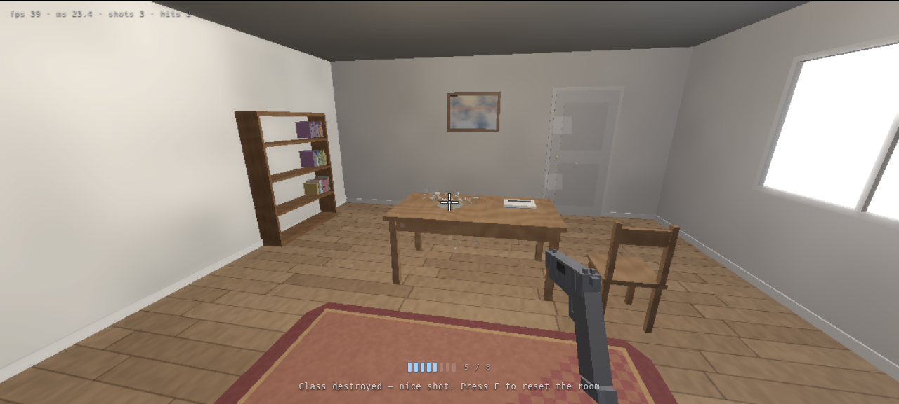

# Room3D

A small first-person 3D scene written in **pure Go**: a room with a table, a drinking
glass of water on it — and a pistol you can draw and fire to shatter the glass.

There is no GPU involved and no 3D library. The Go program rasterizes every frame on the
CPU with its own software renderer and streams the pixels to your browser over a
WebSocket; the browser is only a display, an input device and a sound synthesizer.
Everything you see — the room, the lighting, the glass shards, the muzzle flash — is
computed by Go.



## Run it

```sh
go run .                 # serves http://127.0.0.1:8787/
```

Then open the printed URL in a browser and **click once** to capture the mouse.
Useful flags:

| flag | default | meaning |
| --- | --- | --- |
| `-addr` | `127.0.0.1:8787` | HTTP listen address |
| `-w`, `-h` | `960`, `540` | initial render resolution |
| `-maxw`, `-maxh` | `1280`, `720` | resolution ceiling for the adaptive renderer |
| `-bloom` | `true` | bloom post-processing |
| `-shots DIR` | — | render the verification PNGs into `DIR` and exit (no server) |

## Controls

| input | action |
| --- | --- |
| mouse | look (pointer lock) |
| `W A S D` / arrows | move |
| `Shift` | sprint |
| `Space` | jump |
| **left mouse** | fire — the first click draws the pistol if it is still holstered |
| **`Q` / right mouse** | draw / holster the pistol |
| `R` | reload |
| `F` | reset the room (new glass) |
| `Esc` | release the mouse |

The pistol is holstered when you arrive; locking the pointer draws it automatically
(with a draw animation), and the first shot that connects with the glass shatters it
into ~50 physical shards: they tumble off the table, bounce on the floor, and the water
splashes into droplets that leave a spreading puddle on the tabletop.

## How it works

```
main.go      HTTP + WebSocket server, per-client game loop, adaptive resolution, -shots
render.go    software rasterizer: z-buffer, per-pixel lighting, procedural textures, bloom
mesh.go      indexed meshes, quad/box/lathe/disc/sphere/billboard builders, materials
math3d.go    vectors, matrices, ray/AABB/cylinder intersection
scene.go     the room, table, glass, water, furniture, lights, hitscan
player.go    movement, aim, pistol viewmodel, draw/holster/recoil/reload state machine
shatter.go   glass shard generation from the lathe surface, shard & particle physics
web/         the browser client (vanilla JS/CSS, embedded with go:embed)
PROTOCOL.md  the exact client ↔ server wire format
```

**Renderer.** Triangle rasterization with edge functions and perspective-correct
interpolation, a z-buffer, backface culling, near-plane clipping, Blinn-Phong shading
with a directional "window light", two point lights and hemisphere ambient, procedurally
generated wood/plaster/rug/fabric textures (no image assets), a tone-mapping LUT, and a
bright-pass + separable-blur bloom. Frames are rasterized in parallel horizontal bands
across all CPU cores; opaque geometry is sorted front-to-back so hidden pixels are
rejected before they are shaded.

**Transparency.** Glass, water, shards, particles and ground shadows go into a second
pass that is sorted back-to-front and blended in display space; additive materials
(muzzle flash, sparks, tracers, light pools) are drawn on top.

**Frame streaming.** The server renders only after the client acknowledges the previous
frame, so it never queues work the browser cannot show. The renderer also tunes its own
resolution to hold ~20 ms per frame and tells the client whenever the size changes.

**Shards.** The glass is a lathe (surface of revolution). When it is hit, the same
profile is re-sliced into jittered angular/vertical cells; each cell becomes a closed
8-vertex solid with real thickness, positioned in the world and given velocity from the
impact point, the bullet direction and its own spin. Shards collide with the floor,
walls, table and other furniture and fade out after ~10 s.

## Tests

```sh
go test ./...            # geometry, gameplay, protocol and renderer tests (~7 s)
go test -run Browser     # drives the real client in headless Chromium
go test -bench . -run XXX -benchtime 200x
```

* `mesh_test.go` — every primitive keeps its winding consistent with its shading normal
  (a flipped triangle would be culled or lit from the wrong side); the room shell is
  closed and visible from every direction; props block shots and the player.
* `player_test.go` — draw → aim → fire → shatter → shard settling, reload/empty handling,
  collision (you cannot walk out of the room or through the table), and the viewmodel
  muzzle staying in front of the camera.
* `integration_test.go` — a fake client speaking the real protocol: handshake, frame
  flow control, HUD contents, aiming by mouse deltas, shattering the glass, holstering,
  reset, reload and resize negotiation.
* `browser_test.go` — launches the actual page in headless Chromium, clicks to lock the
  pointer, draws the pistol, moves the mouse to aim, fires, and checks the HUD and the
  painted canvas; leaves `browser-play.png` behind.
* `-shots` renders `shots/01-entry.png` … `08-floor.png`, fixed verification views used
  while tuning the visuals (including a shatter in progress).

## Notes and limitations

* Everything is simulated per connection: every browser tab gets its own room.
* The audio is synthesized in the browser (WebAudio); the server only sends sound events.
* No textures, models or fonts are loaded from disk or the network — the only asset is
  the small handwritten client in `web/`.
* The renderer is CPU-bound: a fast machine will render at 1280×720, a slow one
  automatically drops resolution to keep the frame rate up.
