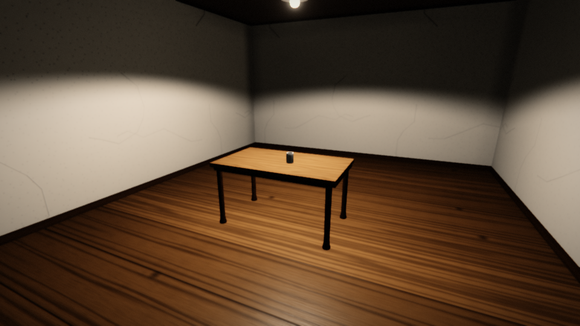
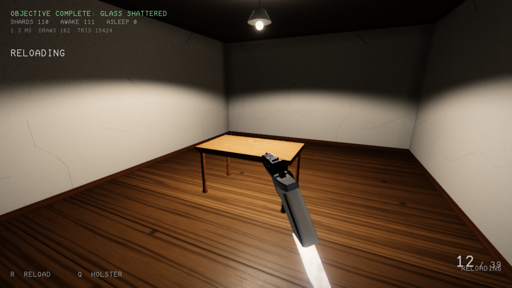
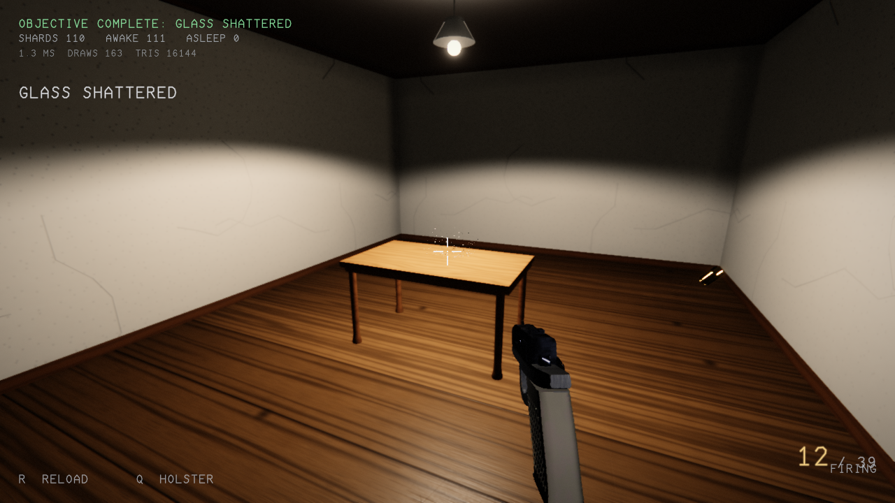

# room2 — a photorealistic, playable Vulkan scene

An empty room with a single light source, a table, and a drinking glass on the table.
You are the player, in first person. You can draw an **HK USP** pistol, shoot the glass
and watch it shatter into physically simulated shards, and reload the pistol.

Everything in the project is generated at runtime — geometry, textures, and every sound
effect. The repository contains **no model, texture, or audio asset files**; the only
inputs are C++ and GLSL source.



| Pistol drawn | Glass shattered |
|---|---|
|  |  |

---

## Build

Requirements:

| Dependency | Notes |
|---|---|
| CMake ≥ 3.20, Ninja or Make | |
| A C++20 compiler | tested with GCC 15 |
| Vulkan headers + loader | Vulkan **1.3** is required (`dynamicRendering`, `synchronization2`, `descriptorIndexing`) |
| `glslc` | from Shaderc; shaders are compiled at build time |
| SDL2 | windowing, input, audio |

```sh
cmake -S . -B build -G Ninja -DCMAKE_BUILD_TYPE=Release
cmake --build build
./build/room2
```

## Controls

Movement, looking and the weapon are sampled from independent sources every frame, so
any combination works at once (walk while turning while firing).

| Input | Action |
|---|---|
| `W A S D` | move |
| `Shift` / `Ctrl` | run / crouch |
| `Space` | jump |
| Mouse | look (the pointer is grabbed as soon as the window opens) |
| **Left mouse** | draw the pistol if holstered, otherwise fire (hold to keep firing) |
| `Q` | holster / draw |
| `R` | reload |
| `Tab` | release / re-grab the mouse cursor |
| `F1`–`F4` | toggle SSAO / bloom / TAA / shadows |
| `F5` | show exactly what input the game is receiving |
| `Esc` | quit |

## What is implemented

### Renderer (`src/render`, `shaders/`)

A deferred physically based renderer built directly on Vulkan 1.3 with dynamic
rendering. One frame is:

1. **Shadow pass** — a 2D perspective (spot) shadow map for the lamp.
2. **G-buffer** — albedo/AO, world normal/roughness, metallic/transmission, emissive +
   linear view depth (4 MRT + D32 depth).
3. **SSAO** — hemisphere sampling at half resolution plus a depth-aware bilateral blur.
4. **Deferred lighting** (compute) — Cook-Torrance GGX direct lighting with PCF
   shadows, an analytic multi-bounce room ambient term, and a split-sum specular term
   sampled from a **procedurally generated, GGX-prefiltered room reflection probe**.
5. **Glass pass** — screen-space refraction of the opaque result, Fresnel-weighted
   screen-space reflection with an environment fallback, Beer-Lambert absorption and a
   shadowed specular highlight.
6. **TAA** — Halton-jittered history resolve with variance clipping and disocclusion
   rejection.
7. **Bloom** — soft-knee prefilter plus a 6-level downsample/upsample chain.
8. **Tonemap** — ACES (Stephen Hill fit), filmic grade, chromatic aberration, vignette,
   film grain.
9. **UI overlay** — crosshair, ammo, objective and diagnostics, drawn from a font atlas
   that is itself rasterised at startup from stroke outlines.

All offscreen targets live permanently in `VK_IMAGE_LAYOUT_GENERAL`; that single
decision removes an entire class of layout-transition bugs at a negligible cost on
desktop GPUs.

### Scene content (`src/scene`)

* **Room** — plaster walls, painted ceiling, plank floor, skirting boards, cornice and
  a ceiling rose, with world-space planar UVs so the tiling is continuous across the
  whole shell.
* **Table** — a slab top, apron rails and four lathed, turned legs.
* **Drinking glass** — a surface of revolution with a real wall thickness and a thick
  base, using a transmissive material (IOR 1.52, Beer-Lambert tint).
* **HK USP** — modelled from primitives in a part hierarchy (slide, barrel, frame,
  grip, trigger, hammer, magazine, floorplate, sights, slide stop, safety, decocker,
  extractor, guide rod, recoil spring; 11.5k triangles). Assembled dimensions match the
  real pistol: 194 × 136 × 33 mm, muzzle at the correct offset from the breech face.
* **Glass fracture** — the impact site produces many small fast fragments while the far
  side breaks into fewer, larger pieces, each a closed convex wedge.

### Physics (`src/physics`)

A self-contained impulse-based rigid body engine: SAT narrow phase with proper contact
manifolds for box/box, box/sphere, box/capsule, sphere/sphere, sphere/capsule and
capsule/capsule; a spatial-hash broadphase; a sequential-impulse solver with warm
starting, Coulomb friction and a non-linear position solver; sleeping; substepping;
analytic raycasts; and a collide-and-slide character controller with auto-stepping.
Deterministic and allocation-free in the steady state (0.17 ms for 260 bodies).

### Audio (`src/audio`)

Every sound is synthesised from DSP primitives at startup: noise generators, ADSR and
exponential envelopes, one-pole/biquad filters, a waveguide resonator for metallic and
glassy partials, soft clipping, and a Schroeder reverb tuned to the room. The mixer is
a lock-free SPSC command ring driving 64 voices with distance attenuation, air
absorption, occlusion filtering, constant-power panning, inter-channel delay and voice
stealing. The gunshot is layered from a transient click, a high-passed crack, a
band-passed body, a downward-swept muzzle thump and a dense plaster-room tail.

### Procedural content (`src/procgen`)

* **Meshes** — box (also inverted, for interiors), plane, UV sphere, cylinder, cone,
  capsule, torus, surface of revolution, rounded box, plus crease-aware normal
  generation, tangents, welding and UV helpers.
* **Textures** — 15 tileable PBR material sets (plaster, painted ceiling, concrete,
  plank floor, table top, varnished wood, blued steel, black polymer, grip panel, brass,
  glass, painted metal, lamp diffuser, fabric, cardboard) with base colour, tangent-space
  normal and packed occlusion/roughness/metallic maps, plus a dependency-free PNG writer.

## Verification

The project builds with no external assets and is verified on a machine with **no GPU
device nodes** by vendoring the Mesa *lavapipe* software Vulkan driver and the Khronos
validation layers into `.tools/` (see `.tools/README.md`). `scripts/verify.sh` runs the
whole suite:

```sh
scripts/verify.sh              # module tests + validation-clean render + self test
```

It performs:

* all six module unit-test suites (700+ checks: physics, audio, mesh, texture, weapon,
  player);
* a **validation-layer-clean** offscreen render (`--headless --screenshot`);
* a **windowed render + present** check (`--windowed-shot`, 30 presented frames), which
  exercises the swapchain path that the headless render cannot reach;
* a scripted gameplay **self test** (`--headless --selftest`) that draws the pistol,
  fires, shatters the glass, reloads, and reports the resulting state.

Diagnostics that ship with the binary:

```sh
room2 --dump-textures DIR     # every procedural material as PNG
room2 --dump-audio DIR        # the whole synthesised sound bank as WAV
room2 --dump-targets DIR      # every internal render target as PNG
room2 --screenshot FILE       # scripted headless run, writes a PNG
room2 --windowed-shot FILE --frames N   # windowed run, captures the presented image
room2 --selftest SECONDS      # scripted run, prints a state report
room2 --no-ssao --no-bloom --no-taa --no-shadows --no-vsync --no-validation
room2 --help
```

### Repository layout

`.gitignore` excludes build output, the runtime pipeline cache, and `.tools/` (the
vendored software driver and validation layers are large third-party binaries — the
README inside that directory explains how to fetch them). `shots/` is intentionally
tracked because the README embeds those images.

### Known limitations

* Shadows come from a single spot light with a 2D map; a second shadow-casting light
  would need another map (the code already loops over `kMaxShadowLights`).
* The weapon view model is rendered in world space at ~0.3 m from the eye rather than in
  a separate depth range, so it can clip into a wall the player is standing against.
* There is no motion-vector buffer, so TAA reprojects with camera motion only; fast
  shards can ghost slightly.
* Glass refraction is screen-space, so it cannot show geometry that is off-screen.
* The windowed path is verified automatically for 30 presented frames, but it cannot be
  *played* interactively on this machine because there is no GPU.

### Verification evidence

`scripts/verify.sh` on this machine (no GPU, lavapipe + Khronos validation):

```
== module unit tests ==            6/6 suites passed (physics, audio, mesh, texture, weapon)
== offscreen render ==             960x540, mean luma 75.0, 97.5% non-black
                                   no Vulkan validation errors
== windowed render + present ==    30 frames rendered and presented
                                   windowed path ran validation-clean
== scripted gameplay self test ==  weapon state      : ready
                                   shots fired       : 1
                                   magazine / reserve: 13 / 38
                                   reloads           : 1
                                   glass broken      : YES at frame 55
                                   shards spawned    : 110
                                   shards awake/asleep: 0 / 111
                                   audio device      : open
                                   last event        : Reloaded
ALL CHECKS PASSED
```
